## Part 0: Prework and starting with Microsoft Azure
**Estimated time: 40 minutes**

The prework for this lab will walk you through the Azure sign-up process, as
well as the preliminary steps of setting up Cloud Shell and provisioning your
first RHEL VM in your new subscription. Full completion of this prework is
necessary not only to gain basic experience with Azure, but to ensure that
the time-consuming "first run" processes happen for your Azure account before
the lab and not during the lab. This will allow us to focus lab time on the
intended lab content. Please complete ALL of Section 0 before coming to the lab.

### Goals of this section:
* Create a Microsoft account (or use an existing one)
* Obtain an Azure Pass code
* Redeem the Azure Pass code for purchasing an Azure subscription
* Provision a RHEL VM in Azure via Azure portal

**IMPORTANT NOTE:** You must [complete this survey](https://forms.office.com/Pages/ResponsePage.aspx?id=v4j5cvGGr0GRqy180BHbR6jGSD76aHBMh0VbmEsVGadUODQ0VTFOVkxEQ1kwREE2ODlEV1JENzdLRC4u) to receive an Azure Pass. If you are unable to use the survey, please <a href="mailto:openshiftrunsonazure@microsoft.com?Subject=Azure Pass request">contact us via email</a> for an Azure Pass as part of this prework. After completing the survey or emailing us you should receive an Azure Pass code within 1 business day. Seriously, stop reading this and
do it RIGHT NOW! We promise to respond as soon as possible, but we sometimes
sleep so we might not respond as quickly to 3am emails. Once you have that pass,
you may complete the rest of the prework.

### 0.1: Signing up for Azure (estimated time: 10 minutes)
You have now presumably received an Azure Pass from us (see the important note
above). This is a code with which you should be able to redeem to obtain $250USD
of credit for Azure services, and it is good for 1 month. Any unused credit at
the end of the month will expire and all paid services will be stopped. You will
have the option of converting your Azure Pass susbcription to one of the paid
options at the expiration time, or you can just let it expire.

You will need a personal Microsoft Account to sign up for the Azure Pass. The Microsoft
Account is required to access Azure services.

> NOTE:
> If you have used any Microsoft Services such as OneDrive, Office365, Outlook.com,
> Hotmail.com, XBox, Skype, or Bing Rewards, or have a @outlook.com, @hotmail.com,
> @live.com email address, then you probably have a Microsoft Account. If you
> don't have a Microsoft account, go to (https://account.microsoft.com) and sign
> up for an account there.
>
> A few notes:
> * you can use (almost) ANY email address to create a new Microsoft account, you don't need to get an outlook.com email address unless you want to during the creation process
> * we recommend using a personal Microsoft account vs. so-called Organizational account (aka "school or work account") for this lab

Once you have a Microsoft account, you will need to sign up for Azure. If you never had a Free trial account on Azure you can go to (https://azure.microsoft.com/free), select "Start Free", and follow the instructions there. For this lab we will be using Azure Pass instead of Free Trial.

### 0.2: Redeeming Azure Pass for an Azure Subscription (estimated time: 15 minutes)
The Azure Pass is a special code that gives you an Azure subscription very
similar to the Azure Free Trial. The Azure Pass does NOT require a credit card
to redeem.

Once you have the code, start the Azure Pass redemption process at
(https://www.microsoftazurepass.com/)
and follow the steps there. Further instructions are available at
(https://www.microsoftazurepass.com/Home/HowTo).

>NOTE:
> Ensure you are redeeming the Azure Pass code under a correct Microsoft account. Start an "in-private" or "incognito" browser session if you are unsure.

### 0.3: Start Cloud Shell for the first time (estimated time: 2 minutes)
In the lab, we will be using the Azure Cloud Shell as our primary means of
deployment. For prework, you will merely open Cloud Shell for the first time.
Doing so will ensure that you have Cloud Shell properly set up in your Azure
Account.

Once you have signed up for Azure and redeemed your Azure Pass, go to
(http://portal.azure.com) and click on the Shell icon on top of the portal page.
You may be asked to select your account.

When prompted, select Bash as your shell of choice. When prompted, click 'Create'
on the storage mounting dialog.

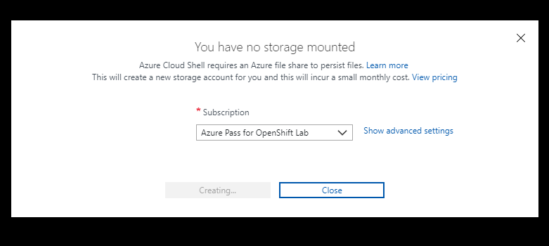

Once your Cloud Shell instance has loaded, feel free to close it as you have
completed this step now. Or play around with it if you so choose :smiley:.

### 0.4: Provision a RHEL VM through the Portal UI (estimated time: 10 minutes)
The final prework step is to provision a RHEL VM using the Azure Portal UI. This
will ensure that everything with your Azure Pass and Azure Account is working
properly before the lab. This should take no longer than a few minutes. Begin by
navigating to (https://portal.azure.com).

1. Click on "Create a resource" in the top left corner of the Portal

    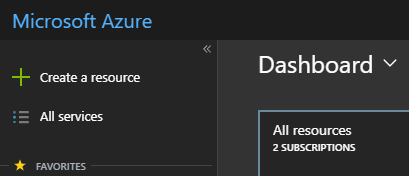

1. Search for "Red Hat" in the search box
1. Select "Red Hat Enterprise Linux 7.5"

    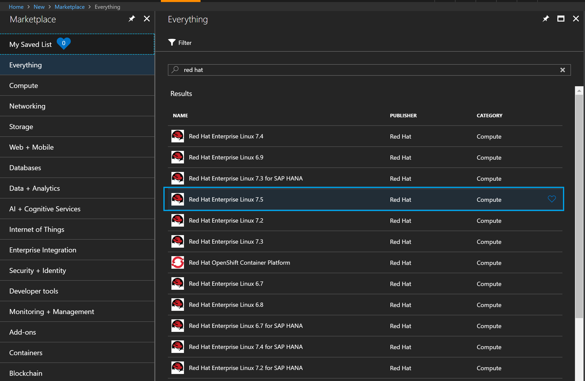

1. Click Create to proceed

    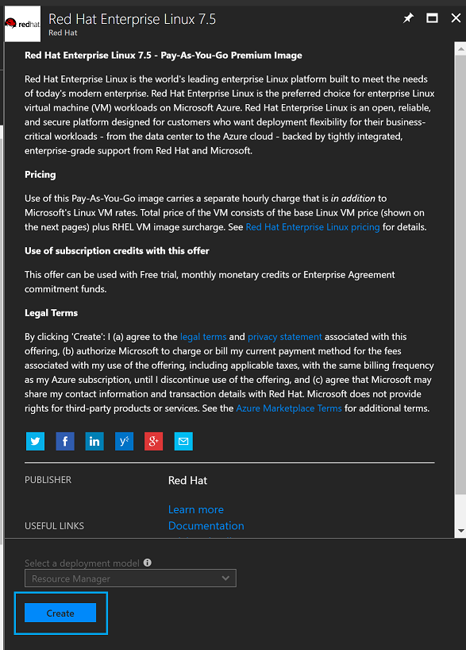

1. In the "Configure basic settings" step, enter the following:
    1. Name: Any arbitrary name
    1. User name: Any arbitrary username
    1. Authentication type: SSH key or Password, as you prefer. If you choose SSH key you can generate a pair in the Cloud Shell which is beyond the scope of this quick intro. Choose and type the password if you just want to move on.
    1. Subscription: Ensure this has selected the subscription you have redeemed
    with your Azure Pass.
    1. Resource group: Choose "Create new", and give it a name
    1. Location: pick one from the list available to you and note what other regions are available in your Azure Pass subscription
    1. Click "OK"

    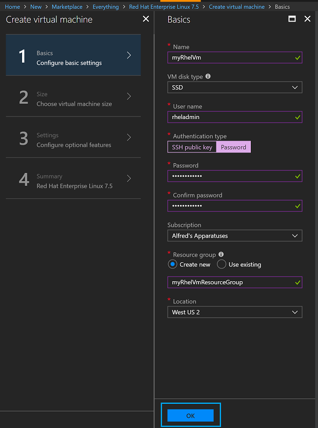

1. In the "Choose a size" step, you will see a recommended VM size. For this prework,
we recommend clicking on "View all" and selecting a 1 core size.

    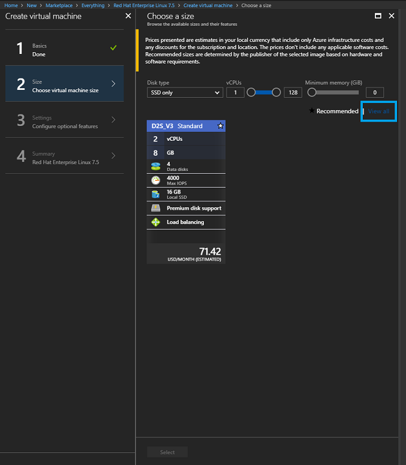

    Choose any 1-core VM size, e.g. B1S (you are free to spin up larger VM sizes,
    but please make sure you do not use up all your credits BEFORE the actual lab).
    Note that in the screenshot below, the vCPUs field has been filtered out.

    > You may need to click on "View all" to view the list of VM sizes

    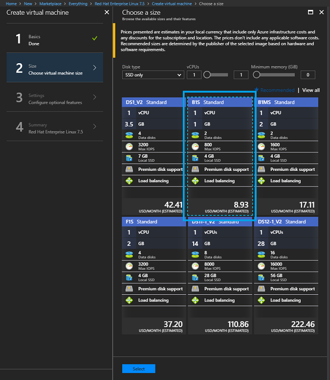

1. In the "Configure optional features" step, you don't have to change anything.
Read it over if you would like, and click "OK".
1. In the Summary step, you can view a summary of the VM you are about to spin up.
You may also have to provide a phone number before provisioning. Have a look and
ensure you like what you see, then click "Create".

    >The first time VM creation will
    >take a few minutes as services are being enabled for the first time for your
    >subscription. You will be redirected back to the Portal dashboard where a tile
    >will appear to indicate that deployment has begun.

    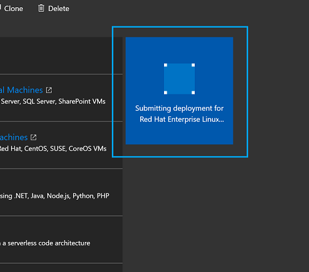

1. Do a happy dance because you just created your first RHEL VM on Azure!
1. You can SSH into the VM from Cloud Shell or from outside of Azure (assuming you kept all default options)

### 0.5: Clean up resources (estimated time: 2 minutes)
Remember when we told you above that your Azure Pass only contains $250USD of
credit? Well we wouldn't want you to use it all up before we even start the lab,
so let's clean up everything we just created so you still have ample credit
during the lab. Azure allows for quick deletion of resources grouped together
through the idea of Resource Groups.

1. From the left side of the Portal, click on "Resource groups"

    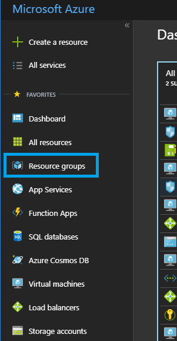

1. Select the Resource Group name that you entered in during your VM creation

    

1. Click on the "Delete resource group" button

    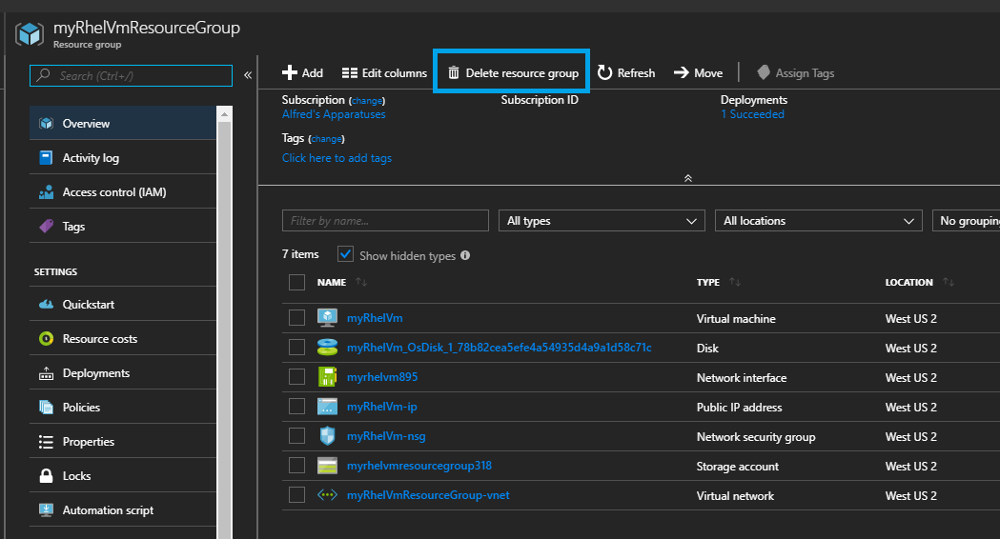

1. Type in the Resource Group name in the text box to tell Azure you're really
sure about deleting it, then click Delete.

    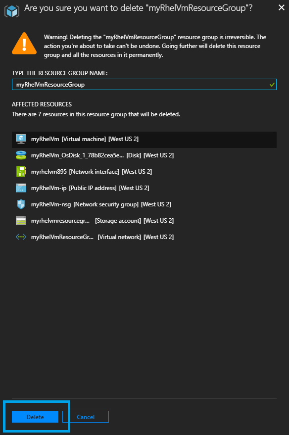

1. You're done with the Prework!

### 0.6: Download OpenShift CLI (estimated time: varies by internet connection)
Because we are going to be using OpenShift CLI tools during the lab, you may want
to download them beforehand so you don't spend time during the lab struggling with
slow bandwidth as everyone else downloads the same 40mb package as you.

[Download OCP CLI tools here](https://access.redhat.com/downloads/content/290/ver=3.9/rhel---7/3.9.25/x86_64/product-software)

__*Stop here now that you're done the Prework. Everything that follows will
be completed during the Red Hat Summit lab itself.*__

[Back to TOC](../README.md) | [Deploying OpenShift](Part1.md)

