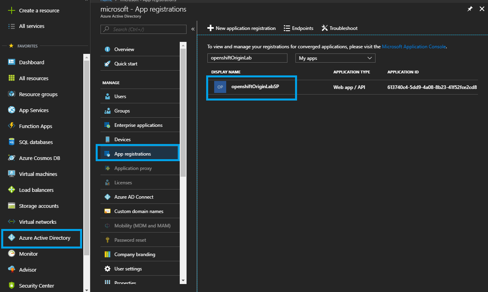
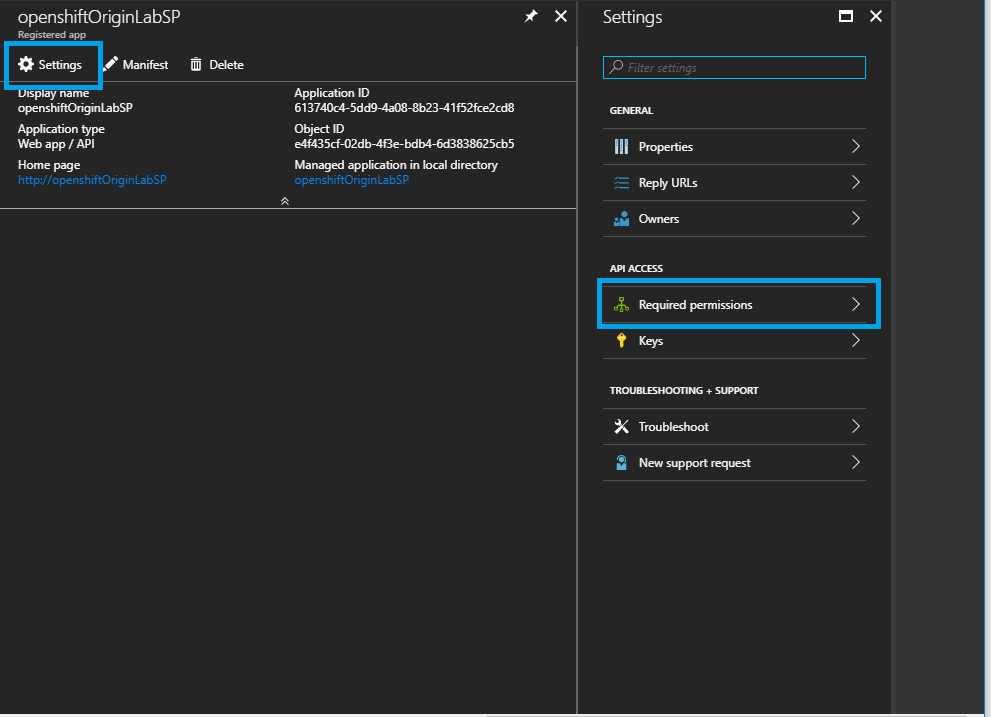
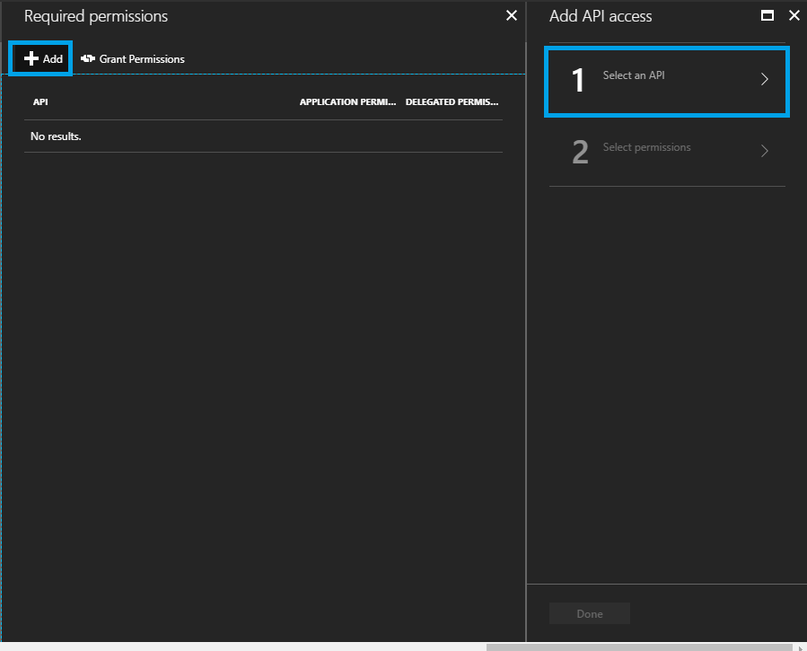
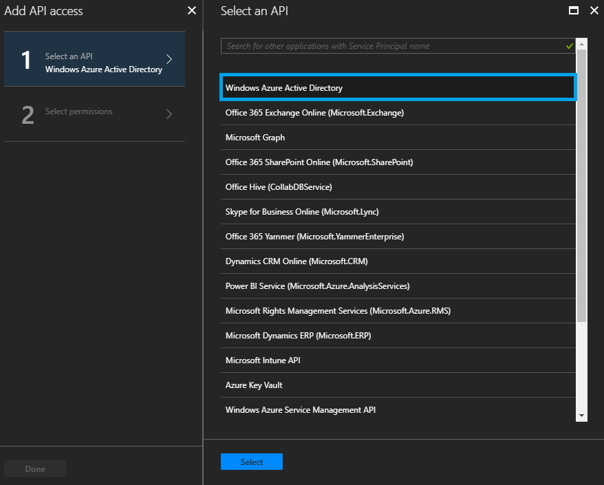
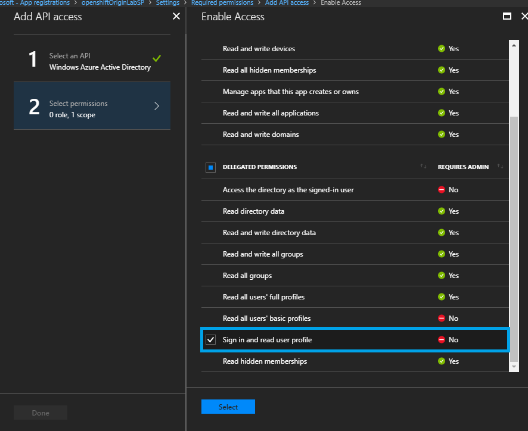
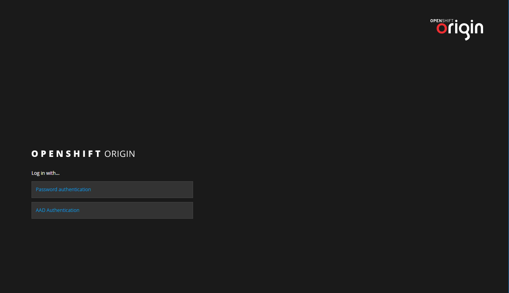

## Part 3 - Advanced OpenShift Topics

### Topic 3.1: Azure Active Directory Integration
Azure Active Directory is Microsoft’s multi-tenant, cloud-based
directory and identity management service that combines core directory services,
application access management, and identity protection into a single solution.

#### 3.1.1: Collect basic information
After you deploy an OpenShift cluster, you can configure single sign-on using
Azure Active Directory (AAD). To do this, you will need to collect 5 pieces of
information.

1. Display name (App registration name)
    * You can retrieve this from the Azure Portal by clicking on Azure Active
      Directory and then on App Registrations
1. App Id
    * You can also retrieve this from App Registrations in the Azure Portal
1. Home page (OpenShift console URL)
    * You can retrieve this using:
        ```bash
        az group deployment list \
          --resource-group <RESOURCE_GROUP_NAME> \
          --query [].properties.outputs \
          --output=json
        ```
1. Identifier URI (Openshift console URL)
    * See above
1. Reply URL (You will need your Master public URL and App registration name)
    * This is constructed as follows:
      `https://<OPENSHIFT_MASTER_PUBLIC_URL>/oauth2callback/<APP_DISPLAY_NAME>`
    * This URL will look something like:
      `https://masterdnsmtnhg3c6h4ji2.westus2.cloudapp.azure.com:8443/oauth2callback/openshiftServicePrincipalName`
1. Tenant Id
    * You can retrieve this with:
      `az account show`
1. Password

#### 3.1.2: Create an App Registration
Create an AAD Application Registration with the following command:

    az ad app create \
        --display-name <YOUR_DISPLAY_NAME_HERE> \
        -- homepage <HOMEPAGE_FROM_ABOVE> \
        -- reply-urls <REPLY-URL_FROM_ABOVE> \
        --identifier-uris <IDENTIFIER-URI_FROM_ABOVE> \
        --password <PASSWORD_FROM_ABOVE>

#### 3.1.3: Add App Permissions from the Azure Portal
We will now grant permissions to the App registration that you created.

1. Go to https://portal.azure.com and click on Azure Active Directory on the
left.
1. Click on App registrations and you will see all your App registrations listed

    

1. Click the current App registration for the OpenShift deploymeny
1. Click Settings and then click "Required permissions"

    

1. Click Add and then click "Select an API"

    

1. Select "Windows Azure Active Directory", then click Select to move onto the
next section

    

1. Under "Delegated Permissions", select "Sign in and read user profile"

    

1. Select "Done"

#### 3.1.4: Configure Master Nodes
*NOTE:* In general, you will have to do this step for every master node you have created.
However, since we only have 1 master node for this lab, you will only have to do
this once.

1. Using the URL from earlier, SSH into the master node

    ```bash
      > ssh -p 2200 <YOUR_ADMIN_USERNAME>@<MASTER_NODE_URL>
    ```
1. Open `/etc/origin/master/master-config.yaml` with your favorite text editor
1. Find the section that looks like this:
    ```bash
        oauthConfig:
          assetPublicURL: https://masterdns343khhde.westus.cloudapp.azure.com:8443/console/
          grantConfig:
            method: auto
          identityProviders:
          - challenge: true
            login: true
            mappingMethod: claim
            name: htpasswd_auth
            provider:
              apiVersion: v1
              file: /etc/origin/master/htpasswd
              kind: HTPasswdPasswordIdentityProvider
    ```
1. Add the following lines immediately after:
    ```bash
          - name: <APP_REGISTRATION_NAME_FROM_ABOVE>
            challenge: false
            login: true
            mappingMethod: claim
            provider:
              apiVersion: v1
              kind: OpenIDIdentityProvider
              clientID: <APP_ID_FROM_ABOVE>
              clientSecret: <PASSWORD_FROM_ABOVE>
              claims:
                id:
                - sub
                preferredUsername:
                - unique_name
                name:
                - name
                email:
                - email
              urls:
                authorize: https://login.microsoftonline.com/<tenantId>/oauth2/authorize
                token: https://login.microsoftonline.com/<tenantId>/oauth2/token
1. Restart OpenShift master services
###OpenShift Origin:
    ```bash
        sudo systemctl restart origin-master-api
        sudo systemctl restart origin-master-controllers
    ```
    * If the restart fails, try entering this command use the output to help debug:
    ```bash
        journalctl -b -el --unit=origin-master-api.service
    ```
###OpenShift Container Platform:
    ```bash
        sudo systemctl restart atomic-openshift-master-api
        sudo systemctl restart atomic-openshift-master-controllers
    ```
#### 3.1.4: Do a happy dance
You are done configuring AAD for your OpenShift deployment! Go to your OpenShift
URL and notice that the login screen now shows you two options to log in.


